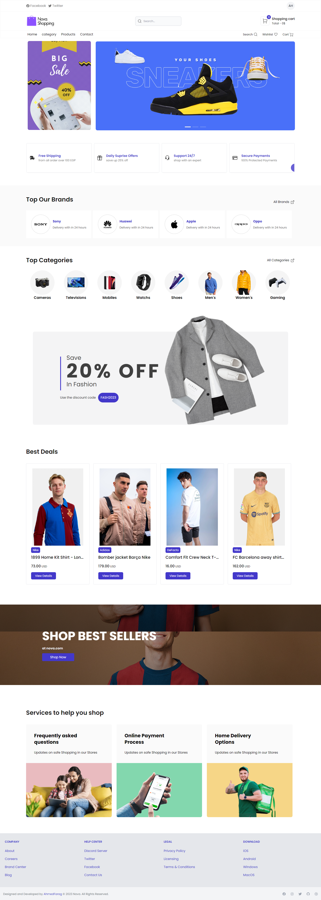

# graduation Ecommerce

<!-- TABLE OF CONTENTS -->

## Table of Contents

- [Overview](#overview)
  - [Built With](#built-with)
  - [Use it after download](#use-it-after-download)
  - [Welcome](#Welcome)
- [Contact](#contact)

<!-- OVERVIEW -->

## Overview

## Welcome! 👋

Thanks for checking out my code of graduation Ecommerce website.
**To do this website, you need a basic understanding of HTML, CSS, Javascript, TailwindCss and Big khnowladge with React and redux else you can use Localstorage.**

### Built With

- Front end
  - HTML
  - CSS
  - Javascript
  - React JS
  - Tailwind Css
  - redux (redux-toolkit)
  - API's
  - Media Query

### Use it after Download

- open project in vs code or any code editor
- write npm install in terminal in project directory
- run npm run dev to run the project
- open http://localhost:3000 and see result
- Back End <b>[Contact to me if need it. it's for another programmer]</b>
  - Asp.net Api
  - Sql server DB

## Contact

- Website [portfolio](http://portfolio-blue-phi.vercel.app/)
- GitHub [@AhmedFarag18](https://github.com/AhmedFarag18)
- Linkedin [@ahmedfarag18](https://www.linkedin.com/in/ahmedfarag18/)

**Have fun building!** 🚀
