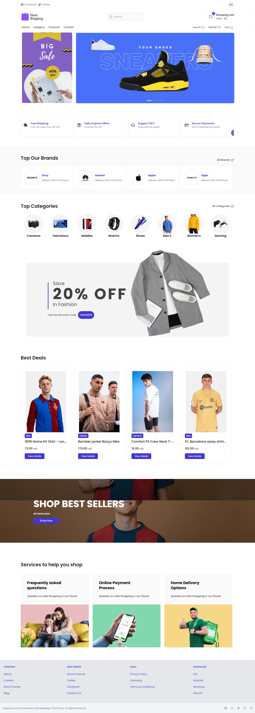

# Nova E-Commerce
## Welcome! 👋
Thanks for checking out my code of Nova Ecommerce website.

Nova E-Commerce is a fully-featured eCommerce application designed to provide a seamless shopping experience. Built with React, Redux, Redux Toolkit, and Tailwind CSS, this project offers a modern and responsive interface for both users and administrators.

## Overview


## Features

### User Features
- **Home Page:** Displays featured products and promotions.
- **Product Catalog:** Browse products with detailed descriptions and images.
- **Shopping Cart:** Add products, view cart contents, and manage item quantities.
- **User Authentication:**
  - **Login:** Access your account securely.
  - **Registration:** Create a new account.
  - **Forgot Password:** Reset your password if forgotten.
  - **Change Password:** Update your current password.
- **Payment Integration:** Secure payments via Stripe API.
- **Product Comments:** Leave comments and reviews on products.

### Admin Features
- **Dashboard:** Manage user roles and permissions.
- **Product Management:** 
  - **Add, Update, or Delete Products:** Manage product listings with images.
  - **Categories and Brands:** Add or modify categories and brands.
  - **Product Images:** Upload main and additional images for each product.
- **User Management:** Assign roles and manage user accounts.

## Installation

1. **Clone the repository:**
   ```bash
   git clone https://github.com/AhmedFarag18/graduation_ecommerce.git
   ```

2. **Navigate to the project directory:**
   ```bash
   cd graduation_ecommerce
   ```

3. **Install dependencies:**
   ```bash
   npm install
   ```

4. **Set up environment variables:**
   Create a `.env` file in the root directory and add the following:
   ```
   REACT_APP_STRIPE_PUBLIC_KEY=your_stripe_public_key
   ```

5. **Run the application:**
   ```bash
   npm start
   ```

## Technologies Used
- **Front end**
  - HTML
  - CSS
  - Javascript
  - React JS
  - Tailwind Css
  - redux (redux-toolkit)
  - API's
  - Media Query
- **Back End** (Contact to me if need it. it's for another programmer)
  - Asp.net Api
  - Sql server DB
- **Payment Processing:**
  - Stripe API

 
### Use it after Download

- open project in vs code or any code editor
- write <span style="color:white;background-color:#222;padding:5px ;width: fit-content;displey:inline-block">npm install</span> in terminal in project directory
- run npm run dev to run the project
- open http://localhost:3000 and see result


### Contact

- Website [portfolio](http://portfolio-blue-phi.vercel.app/)
- GitHub [@AhmedFarag18](https://github.com/AhmedFarag18)
- Linkedin [@ahmedfarag18](https://www.linkedin.com/in/ahmedfarag18/)

**Have fun building!** 🚀


